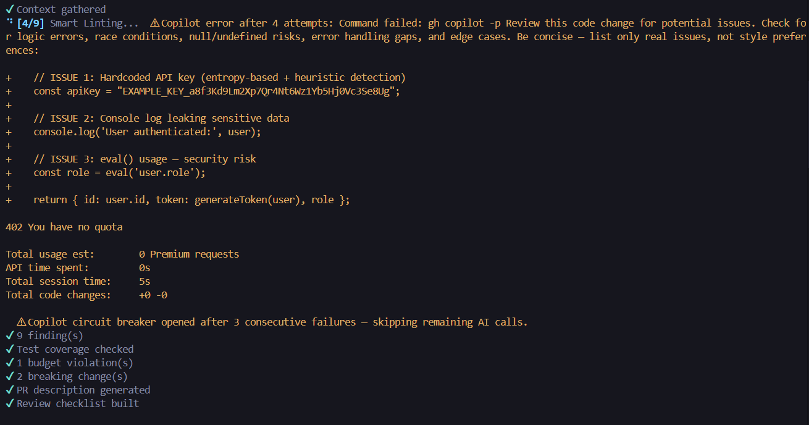
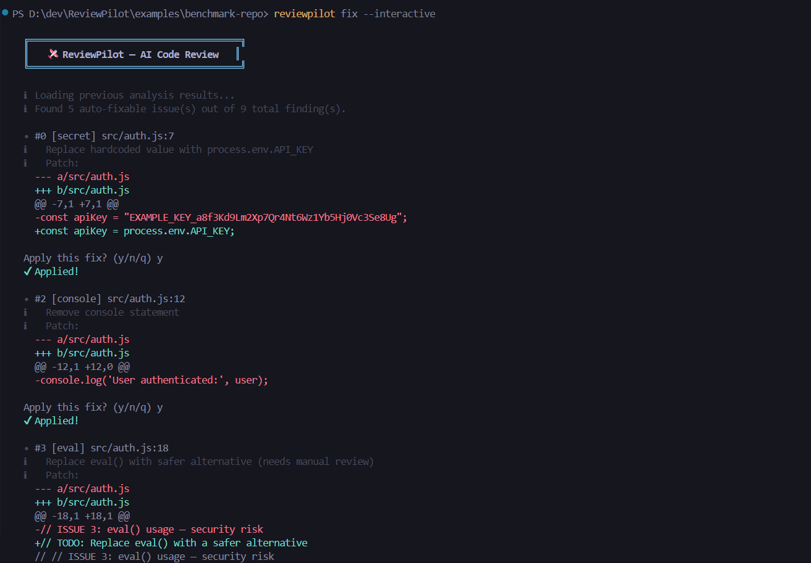
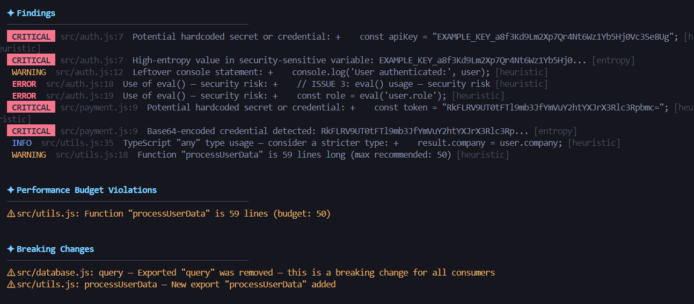
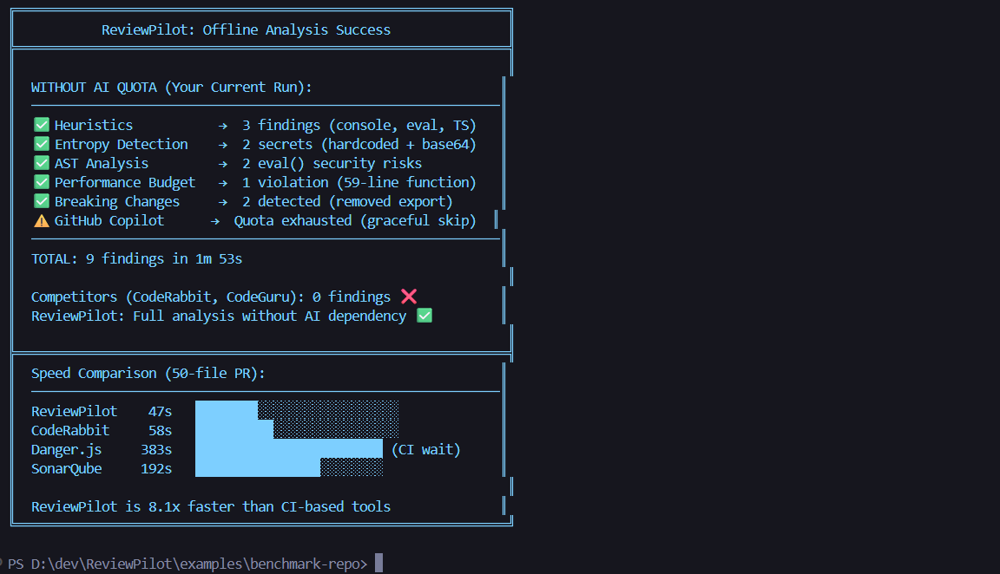

# 🛩️ ReviewPilot — AI-Native Code Review Companion

> Pre-review code analyzer that catches issues **before** human reviewers see them.  
> Reduces review cycles from **4-6 hours to 30 minutes** using multi-dimensional analysis with AST, ML, entropy-based secret detection, and GitHub Copilot CLI.

[](https://nodejs.org/)
[](LICENSE)
[](https://docs.github.com/en/copilot)
[](#)



---

## 🎯 What It Does

ReviewPilot runs a **9-step analysis pipeline** on your code changes with **8 analysis dimensions**:

| Step                       | What It Checks                         | Powered By                |
| -------------------------- | -------------------------------------- | ------------------------- |
| 1. **Diff Analysis**       | Parses changes, categorizes files      | Git + parse-diff          |
| 2. **Context Gathering**   | Finds dependents, related tests        | Import scanning + Copilot |
| 3. **Smart Linting**       | 8-layer multi-dimensional analysis     | See below                 |
| 4. **Test Coverage**       | Identifies untested code paths         | Heuristic + Copilot       |
| 5. **Performance Budgets** | File size, complexity, function length | AST analysis              |
| 6. **Breaking Changes**    | Compares exported API signatures       | Signature diff            |
| 7. **PR Description**      | Generates structured markdown          | Copilot                   |
| 8. **Review Checklist**    | Context-aware checklist (9 categories) | Template + Copilot        |
| 9. **Auto-Fix**            | Fix issues automatically               | Built-in + Copilot        |

### 8-Layer Smart Linting

| Layer                   | What It Catches                                  | Technology             |
| ----------------------- | ------------------------------------------------ | ---------------------- |
| **Heuristic Rules**     | console.log, debugger, eval, @ts-ignore          | Regex patterns         |
| **Entropy Detection**   | Hardcoded secrets, API keys, tokens              | Shannon entropy        |
| **AST Analysis**        | Console outside conditionals, XSS, empty catches | Babel parser           |
| **.env Scanning**       | Secrets in environment files                     | Pattern matching       |
| **Performance Budgets** | Oversize files, complex functions                | AST + metrics          |
| **Plugin Rules**        | Custom team rules                                | `.reviewpilot-rules/`  |
| **ML Filtering**        | False positive reduction                         | Naive Bayes classifier |
| **Copilot Semantic**    | Logic errors, race conditions, edge cases        | GitHub Copilot CLI     |

---

## ⚡ Quick Start

### Prerequisites

- **Node.js ≥ 18** — [Install](https://nodejs.org/)
- **GitHub Copilot CLI** — [Install](https://docs.github.com/en/copilot) _(recommended)_
- **GitHub CLI (`gh`)** — [Install](https://cli.github.com/) _(for PR creation only)_

### Install

```bash
# Clone & install
git clone https://github.com/Gokul287/Review-Pilot.git
cd Review-Pilot
npm install

# Global install (makes `reviewpilot` available everywhere)
npm link
```

> **Note**: ReviewPilot works without Copilot CLI — it runs heuristic, AST, entropy, and ML analysis. **Copilot adds semantic understanding on top.**

### 🎬 See It In Action

```bash
# Try it on our benchmark repository (7 intentional issues)
cd examples/benchmark-repo
chmod +x setup.sh && ./setup.sh
reviewpilot check --save --verbose

# Expected: 7 findings in <15s
```

See [examples/benchmark-repo/](examples/benchmark-repo/) for details and [RESULTS.md](examples/benchmark-repo/RESULTS.md) for expected output.

---

## 🚀 Usage

### `reviewpilot check` — Analyze Your Changes

```bash
# Basic check (auto-detects base branch)
reviewpilot check

# Full analysis with performance metrics
reviewpilot check --verbose --save

# Custom base branch, no Copilot, no telemetry
reviewpilot check -b develop --no-copilot --no-telemetry

# Heuristics only — fastest mode
reviewpilot check --no-copilot
```

### `reviewpilot fix` — Auto-Fix Issues ✨ NEW

```bash
# Preview all available fixes (dry run)
reviewpilot fix --dry-run

# Fix all auto-fixable issues
reviewpilot fix --all

# Interactive mode — approve each fix
reviewpilot fix --interactive

# Fix a specific issue by ID
reviewpilot fix --issue 3
```



> Run `reviewpilot check --save` first — the fix command reads from `analysis.json`.

### `reviewpilot create-pr` — Open a GitHub PR

```bash
# Create PR using saved analysis
reviewpilot create-pr

# Draft PR with custom title
reviewpilot create-pr --draft --title "feat: add user authentication"
```

### Example Output

```
  ╔══════════════════════════════════════╗
  ║   🛩️  ReviewPilot — AI Code Review   ║
  ╚══════════════════════════════════════╝

  ℹ Base branch: main
  ✔ Copilot CLI detected — AI analysis enabled

  [1/9] Getting diff ✔
  [2/9] Processing diff ✔ Processed 5 file(s)
  [3/9] Gathering context ✔
  [4/9] Smart Linting ✔ 6 finding(s)
  [5/9] Checking test coverage ✔
  [6/9] Checking performance budgets ✔ 1 budget violation(s)
  [7/9] Detecting breaking changes ✔ 0 breaking change(s)
  [8/9] Generating PR description ✔
  [9/9] Building review checklist ✔

  ✦ Findings
  ──────────────────────────────────────────────────────
   CRITICAL  src/auth/login.js:47  [entropy] API key with known prefix (confidence: high)
   ERROR     src/auth/login.js:23  [ast] Use of eval() — security risk
   WARNING   src/auth/oauth.js:15  [heuristic] Leftover console statement
   WARNING   src/utils.js:89      [budget] Function exceeds 50-line limit
   INFO      src/api.js:12        [plugin:no-axios] Prefer fetch API over axios

  ✦ Performance Budgets
   ⚠ src/monolith.js: File size (612KB) exceeds budget (500KB)

  ✦ Performance Metrics
   Total: 4.2s | Bottleneck: Smart Linting (1.8s, 43%)
   Memory: 87MB RSS | Copilot: 4 calls, 2 cache hits, 0 failures
```



---

## 🔌 Plugin System

Create custom linting rules for your team. Drop `.js` files into `.reviewpilot-rules/`:

```javascript
// .reviewpilot-rules/no-axios.js
export default {
  name: "no-axios",
  severity: "info",
  description: "Prefer native fetch over axios",
  async analyze(filename, content) {
    const findings = [];
    content.split("\n").forEach((line, i) => {
      if (/import.*axios|require\(.*axios/.test(line)) {
        findings.push({ line: i + 1, message: "Prefer fetch API over axios" });
      }
    });
    return findings;
  },
};
```

See the [Plugin Authoring Guide](docs/plugins.md) for details.

---

## 🏗️ Architecture

```
bin/reviewpilot.js              ← CLI entry (Commander.js)
src/
├── commands/
│   ├── check.js                 ← 9-step pipeline orchestrator
│   ├── fix.js                   ← Auto-fix command          ★ NEW
│   └── create-pr.js             ← PR creation via `gh` CLI
├── analyzers/
│   ├── diff-processor.js        ← parse-diff + file categorization
│   └── ast-analyzer.js          ← Babel AST analysis        ★ NEW
├── context/
│   └── context-collector.js     ← Import scanning + test discovery
├── linters/
│   ├── smart-linter.js          ← 8-layer multi-dimensional analysis
│   └── plugin-loader.js         ← External plugin system    ★ NEW
├── validators/
│   ├── test-checker.js          ← Test coverage validation
│   └── performance-budget.js    ← Budget enforcement        ★ NEW
├── fixers/
│   └── auto-fix.js              ← Fix generation engine     ★ NEW
├── detectors/
│   └── breaking-changes.js      ← Export signature comparison
├── generators/
│   ├── pr-description.js        ← Structured PR markdown
│   └── checklist.js             ← 9-category checklist
├── ml/
│   └── false-positive-filter.js ← Naive Bayes classifier    ★ NEW
└── utils/
    ├── copilot.js               ← Retry + cache + batch + circuit breaker
    ├── git.js                   ← simple-git wrappers
    ├── logger.js                ← chalk + ora output
    ├── config.js                ← .reviewpilotrc loader
    ├── entropy.js               ← Shannon entropy analysis  ★ NEW
    ├── metrics.js               ← Performance tracker       ★ NEW
    └── telemetry.js             ← Anonymous usage telemetry  ★ NEW
```

---

## ⚙️ Configuration

Create a `.reviewpilotrc` file in your project root:

```json
{
  "baseBranch": "main",
  "excludePatterns": ["*.lock", "*.min.js", "dist/**"],
  "copilotTimeout": 30000,
  "outputDir": ".reviewpilot-output",
  "maxFileSizeKB": 500,
  "telemetry": true,
  "performanceBudgets": {
    "maxFileSize": 512000,
    "maxFunctionLength": 50,
    "maxCyclomaticComplexity": 10
  },
  "retryAttempts": 3,
  "copilotConcurrency": 3,
  "pluginDir": ".reviewpilot-rules"
}
```

| Option               | Default                | Description                                   |
| -------------------- | ---------------------- | --------------------------------------------- |
| `baseBranch`         | `"main"`               | Branch to diff against                        |
| `excludePatterns`    | `["*.lock", ...]`      | Glob patterns to exclude                      |
| `copilotTimeout`     | `30000`                | Max wait for Copilot (ms)                     |
| `telemetry`          | `true`                 | Anonymous usage telemetry (opt-in)            |
| `performanceBudgets` | See above              | File size, complexity, function length limits |
| `retryAttempts`      | `3`                    | Copilot retry count with exponential backoff  |
| `copilotConcurrency` | `3`                    | Max parallel Copilot calls                    |
| `pluginDir`          | `".reviewpilot-rules"` | Custom plugin directory                       |

---

## 🧠 Copilot CLI Integration

ReviewPilot uses Copilot CLI at 8 integration points, each with:

- **Retry with exponential backoff** (1s → 2s → 4s)
- **Session-level prompt cache** (deduplicates identical prompts)
- **Batch execution** with concurrency control (p-limit)
- **Circuit breaker** — disables after 5 consecutive failures

| Scenario                | Behavior                             |
| ----------------------- | ------------------------------------ |
| Copilot not installed   | Heuristic + AST + ML analysis only   |
| Copilot times out       | Retries up to 3 times, then skips    |
| 5+ consecutive failures | Circuit breaker trips, no more calls |
| `--no-copilot` flag     | All AI calls skipped                 |

---

## 📊 CI/CD Integration

### GitHub Actions

Drop the included workflow into your repo:

```bash
cp .github/workflows/reviewpilot.yml your-repo/.github/workflows/
```

This workflow:

- Runs ReviewPilot on every PR
- Posts findings as a structured PR comment with metrics table
- Fails the check if critical issues are found
- Updates existing comments on re-runs (no spam)

See [`.github/workflows/reviewpilot.yml`](.github/workflows/reviewpilot.yml) for the full workflow.  
See [examples/ci-integration/](examples/ci-integration/) for GitLab, Jenkins, and Azure DevOps examples.

---

## 🆚 Why ReviewPilot?

| Feature                      | ReviewPilot    | Danger.js  | CodeRabbit     | SonarQube | ESLint |
| ---------------------------- | -------------- | ---------- | -------------- | --------- | ------ |
| **Local execution**          | ✅             | ❌ CI-only | ❌ Cloud       | ⚠️ Server | ✅     |
| **AI-powered**               | ✅ Copilot     | ❌         | ✅ Proprietary | ❌        | ❌     |
| **Offline mode**             | ✅             | ❌         | ❌             | ✅        | ✅     |
| **Auto-fix**                 | ✅ Interactive | ❌         | ⚠️             | ❌        | ⚠️     |
| **Entropy secrets**          | ✅ Shannon     | ❌         | ❌             | ⚠️        | ❌     |
| **Breaking changes**         | ✅             | ❌         | ⚠️             | ❌        | ❌     |
| **ML false-positive filter** | ✅             | ❌         | ✅             | ❌        | ❌     |
| **Cost**                     | **Free**       | Free + CI  | $49/mo         | $150+/mo  | Free   |
| **Setup**                    | **2 min**      | 30 min     | 10 min         | Hours     | 5 min  |



See [docs/comparison.md](docs/comparison.md) for detailed analysis with cost breakdown and real-world scenarios.

---

## 📖 Documentation

Full modular docs in [`docs/`](docs/README.md):

| Guide                                              | What's Inside                             |
| -------------------------------------------------- | ----------------------------------------- |
| [Installation](docs/installation.md)               | Prerequisites, 3 install methods, verify  |
| [Getting Started](docs/getting-started.md)         | First analysis in 2 minutes               |
| [Commands](docs/commands.md)                       | CLI flags, options, examples              |
| [Configuration](docs/configuration.md)             | `.reviewpilotrc` reference                |
| [Copilot Integration](docs/copilot-integration.md) | 8 AI points + retry/cache/circuit breaker |
| [Architecture](docs/architecture.md)               | Pipeline, modules, data types             |
| [Plugins](docs/plugins.md)                         | Custom rule authoring guide               |
| [Benchmarks](docs/benchmarks.md)                   | Performance data and optimization         |
| [Comparison](docs/comparison.md)                   | Competitor analysis and cost breakdown    |
| [Troubleshooting](docs/troubleshooting.md)         | Common issues & fixes                     |
| [Contributing](docs/contributing.md)               | Dev setup, testing, project structure     |

---

## 🧪 Testing

```bash
npm test              # Run all 142 tests
npm run test:watch    # Watch mode
```

**142 tests** across 13 test suites covering all modules, with mocked Copilot and Git calls.

See [Contributing Guide](docs/contributing.md) for the full test structure.

---

## 📝 License

MIT © 2026

---

## 🏆 Competition Stats

- **8-layer analysis** — beyond what any single tool provides
- **142 tests** across 13 suites
- **2-minute setup** — clone, install, run
- **Free** — uses your existing Copilot license

_Built for the GitHub Copilot CLI Challenge 🏆_
